# JOB DESCRIPTION
Audit APISIX API gateway configuration for security best practices, including WAF rules, rate limiting, authentication, and SSL/TLS configuration

# Progress
Here are the progress every day on working it

## 14 August 2026
Result :
- Setup with Quickinstall Configuration APISIX
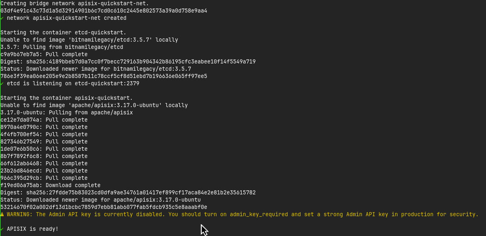

- mTLS Config Result
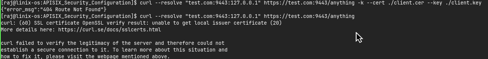

- Installation of Batch-Requests Plugin in Quickinstall
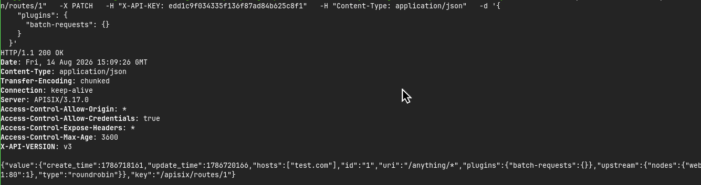

- APISIX Docker Configuration Preparation
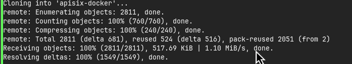
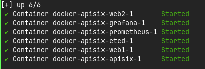

Documentation Source:
- [SSL Configuration](https://www.youtube.com/watch?v=degTCVeAvLs)
- [APISIX Documentation] (https://apisix.apache.org/docs/apisix/)

## 15 August 2026
For this day, the report will be focus on sum general plugins.
### 1st Step to Set Plugins in APISIX
The most important step. If we don't do it, then plugin might not be able to be configured. 
#### Set config.yaml
Used as a system and core configuration. Plugins installation was also set in here. Here are additional setting from me for today
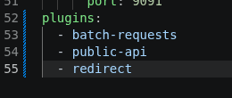

#### Route Plugin Configuration
Plugin configuration directly in a route config
```bash
curl http://127.0.0.1:9180/apisix/admin/routes/<id> -H "X-API-KEY: $admin_key" -X PUT -d '
{ ... }
'
# <id> is the identifier for each routes and its plugins configs
```

#### Metadata Plugin Configuration
Specific plugin configuration
```bash
curl http://127.0.0.1:9180/apisix/admin/plugin_metadata/<plugin-name> -H "X-API-KEY: $admin_key" -X PUT -d '
{ ... }'
```

### Public API
It's an important plugin. If not installed it, then it will be a problem for some plugin. **Why?** Because we need it to make sure some our plugins configuration to be able reached by client. It even stated on some plugins like `Batch Requests`
- Set Public API
```bash
curl http://127.0.0.1:9180/apisix/admin/routes/<id> -H "X-API-KEY: $admin_key" -X PUT -d '
{
    "uri": <public-endpoint>,
    "plugins": {
        "public-api": {
            "uri": <internal-route>
            # if this uri is not set, then it will be set same as public endpoint
        }
    }
}
```
- Batch Requests (Before)
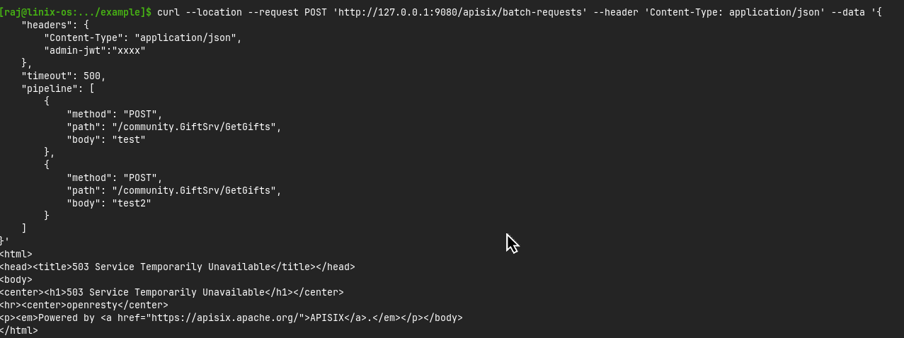
- Batch Requests (After)
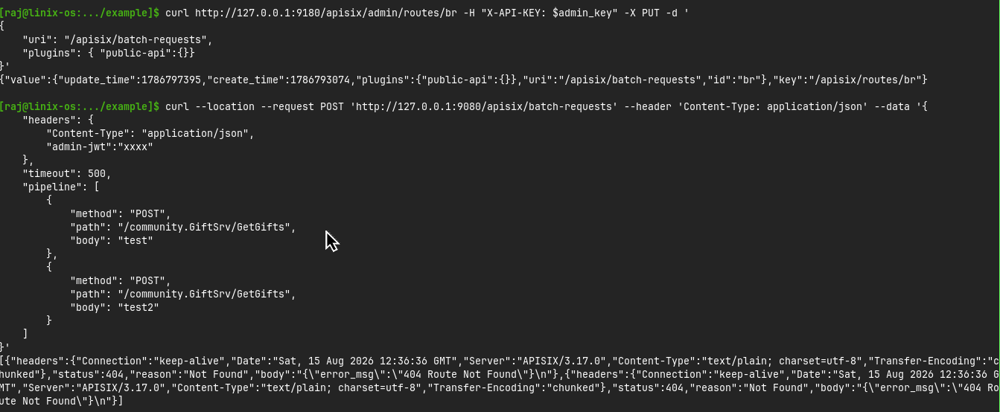

### Batch Requests
The Batch Requests is a plugin that used for requesting some data at the same time. It's so usefull for client. Because of it, client doesn't have to open many HTTP Requests, reduce its latency, and handshake TLS. However, in APISIX side, it's still receiving all requests. It can also be more heavier.
- Config
```bash
curl http://127.0.0.1:9180/apisix/admin/plugin_metadata/batch-requests -H "X-API-KEY: $admin_key" -X PUT -d '
{
    "max_body_size": 4194304
}'
# to publish publicly
curl http://127.0.0.1:9180/apisix/admin/routes/br -H "X-API-KEY: $admin_key" -X PUT -d '
{
    "uri": "/apisix/batch-requests",
    "plugins": {
        "public-api": {}
    }
}'
```
- Result


[Source documentation](https://apisix.apache.org/docs/apisix/plugins/batch-requests/)
### Redirect
As the name, the focus of this plugin is for redirecting. But, this is more than regullar redirect. It can redirect from http to https, can redirecting to different domain, and can even set read regex if client type or anything. 

- Before Redirect

- After Redirect


[Source documentation](https://apisix.apache.org/docs/apisix/plugins/redirect/)

### Echo

Similar to the `echo` command in CLI, this plugin helps return additional information in the response when making a request.


[Source documentation](https://apisix.apache.org/docs/apisix/plugins/echo/)

## 18th August 2026
Continue the previous progress. Still focusing in plugins review. The main focus now is Real-IP, Response-Rewrite, and Server info. Make sure to installed it first in `config.yml`

### Real-IP && Response-Rewrite
Real-IP is used to create same IP address for clients to identify them. With it, we can now know from which client the Requests came. **Why?** Because there is cases when we needed to really know them. 

Response Rewrite is to edit or create additional information from response. **WHY WITH REAL-IP?** Because we wanna know is the Real-IP really works or not. If we didn't use it, then we can not possibly know it's really change the IP or not. For that, we can use this plugin for debugging.

```bash
curl "http://127.0.0.1:9180/apisix/admin/routes/real-ip-route" \
  -X PATCH \
  -H "X-API-KEY: ${admin_key}" \
  -d '{
    "plugins": {
      "real-ip": {
        "source": "arg_realip",
        "trusted_addresses": [
          <legal-proxy-ip-to-inform>
        ]
      },
      "response-rewrite": {
        "headers": {
          "remote_addr": "$remote_addr",
          "remote_port": "$remote_port"
        }
      }
    }
  }'
#   Remote addr and port is for revealing the Real-IP

```
- Config

- Testing


### Server Info
Used to periodically reports basic server information to etcd. The most importantly, to recap it. Foe the rest, will be informed later.

## 19th August 2026
More review of plugins. The focus are server-info, gzip, proxy-rewrite, grpc-transcode, and grpc-web

### Server Info
#### The configuration
1. Set it in config.yaml

2. Activate control API in APISIX


#### Test Result

### Gzip
It's used to minimize a big responses. Same as, zip command in file manager. However, it's oriented in response and client should have to set `Accept-Encoding` header firts to use it.

#### Configuration

#### Test Result
- Before
Only base response

- After
Can change it to zip if it's too big


### Proxy Rewrite
It's a plugin to rewrite requests that APISIX forwards to Upstream services. With it, we can finally access the certain path or location from Upstream services. We can also modify the methods, request destination Upstream addresses, request headers, and more.

#### Configuration

#### Test Result
- Before
Only access the default location of nginx
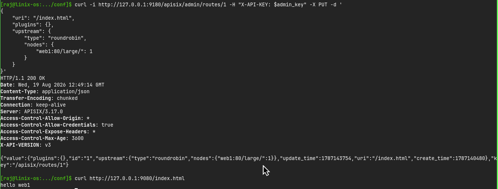
- After
Access the specific location of nginx


### gRPC
gRPC stands for Google Remote Procedure Call. Was created in 2015 with plan to change or be an alternative from traditional REST, especially to communicate between servers (backend-to-backend). Very usefull in microservices.

#### Short gRPC Project
1. gRPC Example
Run it to create gRPC example project
```bash
docker run -d \
  --name grpc-example-server \
  -p 50051:50051 \
  api7/grpc-server-example:1.0.2
```
2. gRPCBinServer
Start a grpcbinserver
```
docker run -d \
  --name grpcbin \
  -p 9000:9000 \
  moul/grpcbin
```

#### gRPC Transcode
The `grpc-transcode` Plugin transforms between HTTP requests and gRPC requests, as well as their corresponding responses.

With this Plugin enabled, APISIX accepts an HTTP request from the client, transcodes and forwards it to an upstream gRPC service. When APISIX receives the gRPC response, it will transform the response back to an HTTP response and send it to the client.

##### Configuration
1. Create proto resource
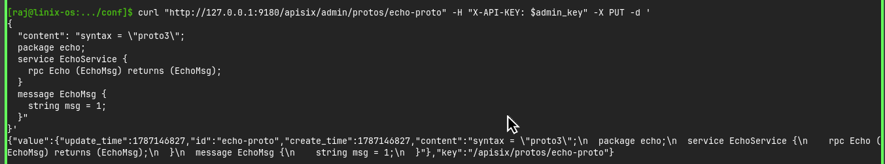
2. Create `grpc-transcode` route
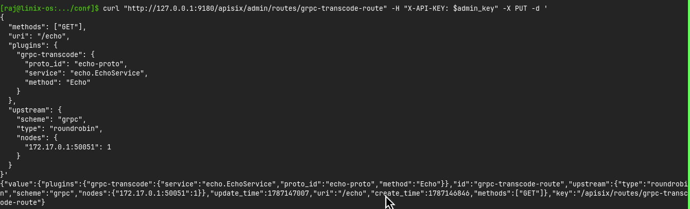
##### Testing
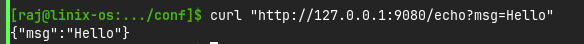

#### gRPC Web
gRPC is a high-performance RPC framework based on HTTP/2 and Protocol Buffers, but it is not natively supported by browsers. gRPC-Web defines at browser-compatible protocol for sending gRPC requests over HTTP/1.1 or HTTP/2.

## 20th August 2026
Continue reviewing plugins. The main focus are : gRPC Web, Fault Injection, Mocking, Security Plugins, abd Traffic Plugins.

### gRPC Web
#### Configuration
1. Create routes
```bash
curl "http://127.0.0.1:9180/apisix/admin/routes/grpc-web-route" -H "X-API-KEY: $admin_key" -X PUT -d '
{
  "uri": "/grpc/web/*",
  "plugins": {
    "grpc-web": {}
  },
  "upstream": {
    "scheme": "grpc",
    "type": "roundrobin",
    "nodes": {
      "172.17.0.1:9000": 1
    }
  }
}'
```
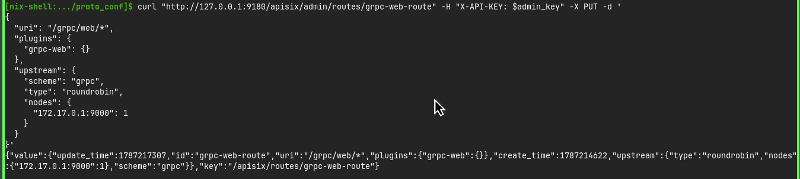
2. Make sure to install requirement tools
Tools :
- protobuf
- protoc-gen-grpc-web
- protoc-gen-js
- nodejs

If you use Nixos, you may do this command to installed it temporary :
```bash
cd conf/
nix-shell
```

3. Generate gRPC-Web Client Code
```bash
curl -O https://raw.githubusercontent.com/moul/pb/master/hello/hello.proto
protoc \
  --js_out=import_style=commonjs:. \
  --grpc-web_out=import_style=commonjs,mode=grpcwebtext:. \
  hello.proto
```

4. Create a Client (`client.js`)
- Run it first

```bash
npm init -y
npm install xhr2 grpc-web google-protobuf
```
- Create `client.js`
Create it in the same directory with hello.proto. You can copy it from `conf/proto_conf/client.js`

#### Testing
1. Make sure gRPC bin Active
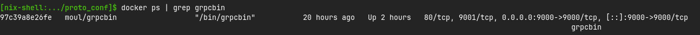
2. Run `client.js`
```bash
node client.js
```
3. Result
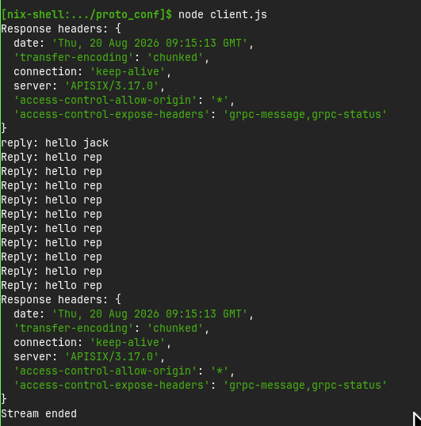

### Fault Injection
The plugin you should know if want to debugging. This plugin helps us to simulate error, high latency, test fallback, etc. It executes before other configured Plugins, ensuring that faults are applied consistently. This makes it ideal for scenarios like chaos engineering, where the behavior of your system under failure conditions is analyzed.

#### Simple Configuration and Its Test
1. Inject Faults
Configuration to create an error without any condition.
- Config
```bash
curl "http://127.0.0.1:9180/apisix/admin/routes" -X PUT   -H "X-API-KEY: ${admin_key}"   -d '{
    "id": "fault-injection-route",
    "uri": "/anything",
    "plugins": {
      "fault-injection": {
        "abort": {
          "http_status": 404,
          "body": "APISIX Fault Injection"
        }
      }
    },
    "upstream": {
      "type": "roundrobin",
      "nodes": {
        "httpbin.org:80": 1
      }
    }
  }'
```
- Test
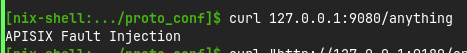

2. Inject Latencies
To lating the test
- Config
```bash
curl "http://127.0.0.1:9180/apisix/admin/routes" -X PUT \
  -H "X-API-KEY: ${admin_key}" \
  -d '{
    "id": "fault-injection-route",
    "uri": "/anything",
    "plugins": {
      "fault-injection": {
        "delay": {
          "duration": 3
        }
      }
    },
    "upstream": {
      "type": "roundrobin",
      "nodes": {
        "httpbin.org:80": 1
      }
    }
  }'
```
- Test
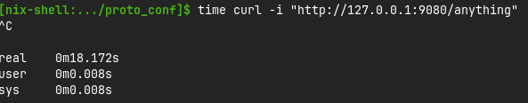

3. Inject Faults Conditionally 
Configuration to create an error with one or many conditions.
- Config
```bash
curl "http://127.0.0.1:9180/apisix/admin/routes" -X PUT \
  -H "X-API-KEY: ${admin_key}" \
  -d '{
    "id": "fault-injection-route",
    "uri": "/anything",
    "plugins": {
      "fault-injection": {
        "abort": {
          "http_status": 404,
          "body": "APISIX Fault Injection",
          "headers": {
            "X-APISIX-Remote-Addr": "$remote_addr"
          },
          "vars": [
            [
              [ "arg_name","==","john" ]
            ]
          ]
        }
      }
    },
    "upstream": {
      "type": "roundrobin",
      "nodes": {
        "httpbin.org:80": 1
      }
    }
  }'
```
- Test


### Mocking
API Mocking (`mocking`), Plugin allows you to simulate API responses without forwarding requests to Upstream services. The Plugin supports customization of the response status code, body, headers, and more. This is particularly useful during development, testing, or debugging phases, where the actual Upstream service might be unavailable, under maintenance, or expensive to call.

#### Configuration and Test
1. Simple Response
- Config
```bash
curl "http://127.0.0.1:9180/apisix/admin/routes" -X PUT \
  -H "X-API-KEY: ${admin_key}" \
  -d '{
    "id": "mocking-route",
    "uri": "/anything",
    "plugins": {
      "mocking": {
        "response_status": 201,
        "response_example": "{\"Lastname\":\"Brown\",\"Age\":56}"
      }
    },
    "upstream": {
      "type": "roundrobin",
      "nodes": {
        "httpbin.org:80": 1
      }
    }
  }'
```
- Test
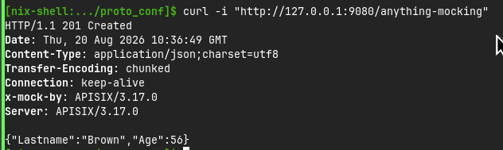
2. JSON Response
- Config
```bash
curl "http://127.0.0.1:9180/apisix/admin/routes" -X PUT \
  -H "X-API-KEY: ${admin_key}" \
  -d '{
    "id": "mocking-route",
    "uri": "/anything",
    "plugins": {
      "mocking": {
        "response_schema": {
          "type": "object",
          "properties": {
            "id": {
              "type": "string",
              "example": "abcd"
            },
            "ip": {
              "type": "number",
              "example": 192.168
            },
            "random_str_arr": {
              "type": "array",
              "items": {
                "type": "string"
              }
            },
            "nested_obj": {
              "type": "object",
              "properties": {
                "random_str": {
                  "type": "string"
                },
                "child_nested_obj": {
                  "type": "object",
                  "properties": {
                    "random_bool": {
                      "type": "boolean",
                      "example": true
                    },
                    "random_int_arr": {
                      "type": "array",
                      "items": {
                        "type": "integer",
                        "example": 155
                      }
                    }
                  }
                }
              }
            }
          }
        }
      }
    },
    "upstream": {
      "type": "roundrobin",
      "nodes": {
        "httpbin.org:80": 1
      }
    }
  }'
```
- Test
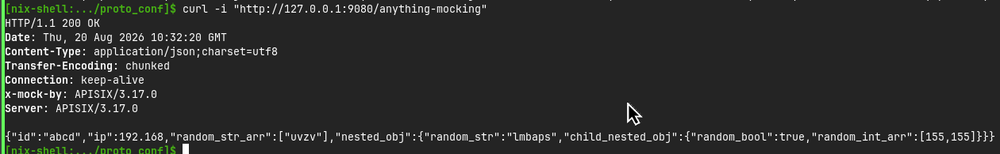

### Security Plugins

#### Cors
The `cors` plugin allows you to enable Cross-Origin Resource Sharing (CORS). CORS is an HTTP-header based mechanism which allows a server to specify any origins (domain, scheme, or port) other than its own, and instructs browsers to allow the loading of resources from those origins.
- Configuration
```bash
curl "http://127.0.0.1:9180/apisix/admin/routes" -X PUT   -H "X-API-KEY: ${admin_key}"   -d '{
    "id": "cors-route",
    "uri": "/cors",
    "plugins": {
      "cors": {
        "allow_origins": "http://sub.domain.com,http://sub2.domain.com",
        "allow_methods": "GET,POST",
        "allow_headers": "headr1,headr2",
        "expose_headers": "ex-headr1,ex-headr2",
        "max_age": 50,
        "allow_credential": true
      }
    },
    "upstream": {
      "nodes": {
        "httpbin.org:80": 1
      },
      "type": "roundrobin"
    }
  }'
```
- Test
Without Origin Header
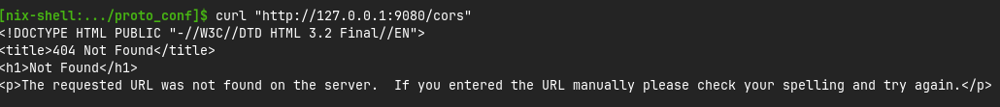
With Origin Header
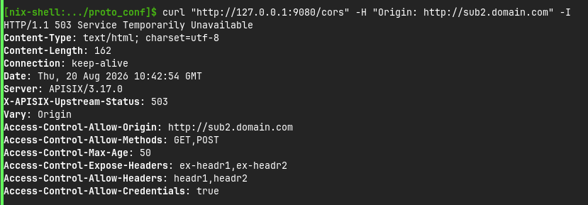

#### URI Blocker
The `uri-blocker` plugin intercepts user requests with a set of `block_rules`. It's using blacklist mechanism. Will be helpfull if there's some URI that doesn't want to be public

- Configuration
```bash
curl -i http://127.0.0.1:9180/apisix/admin/routes/1 -H "X-API-KEY: $admin_key" -X PUT -d '
{
    "uri": "/*",
    "plugins": {
        "uri-blocker": {
            "block_rules": ["root.exe", "root.m+"]
        }
    },
    "upstream": {
        "type": "roundrobin",
        "nodes": {
            "127.0.0.1:1980": 1
        }
    }
}'
```
- Test
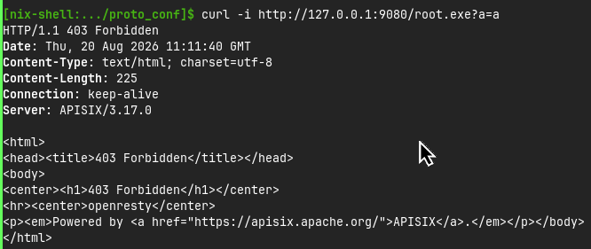

#### IP Restriction
The `ip-restriction` plugin supports restricting access to Upstream resources by IP addresses, through either configuring a whitelist or blacklist of IP addresses. Restricting IP to resources helps prevent unauthorized access and harden API security.

- Configuration
You may choose between *whitelist* or *blaclist* option
```bash
curl "http://127.0.0.1:9180/apisix/admin/routes" -X PUT \
  -H "X-API-KEY: ${admin_key}" \
  -d '{
    "id": "ip-restriction-route",
    "uri": "/ip-restrict",
    "plugins": {
      "ip-restriction": {
        "whitelist": [
          "192.168.0.1/24"
        ],
        "message": "Access denied"
      }
    },
    "upstream": {
      "type": "roundrobin",
      "nodes": {
        "httpbin.org:80": 1
      }
    }
  }'
```
- Test
Before
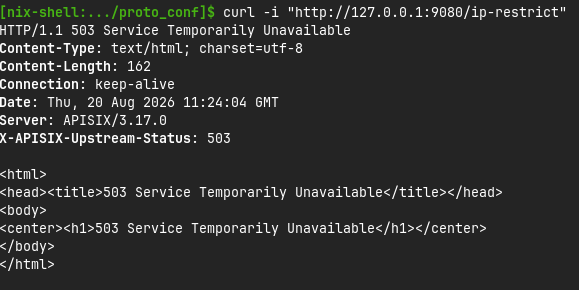

After
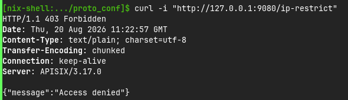

#### UA Restriction
The `ua-restriction` plugin supports restricting access to upstream resources through either configuring an allowlist or denylist of user agents. A common use case is to prevent web crawlers from overloading the upstream resources and causing service degradation.

- Configuration
```bash
curl "http://127.0.0.1:9180/apisix/admin/routes" -X PUT   -H "X-API-KEY: ${admin_key}"   -d '{
    "id": "ua-restriction-route",
    "uri": "/ua-res",
    "plugins": {
      "ua-restriction": {
        "bypass_missing": false,
        "denylist": [
          "(Baiduspider)/(\\d+)\\.(\\d+)",
          "bad-bot-1"
        ],
        "message": "Access denied"
      }
    },
    "upstream": {
      "type": "roundrobin",
      "nodes": {
        "web2:80": 1
      }
    }
  }'
```
- Test
Non Forbidden Agent
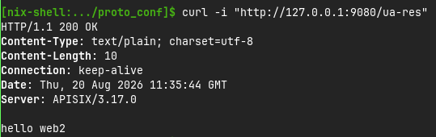

Forbidden Agent
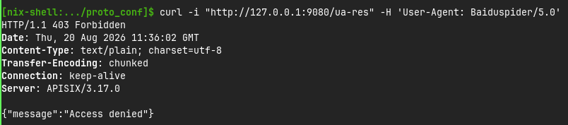

#### Referer Restriction
The `referer-restriction` Plugin can be used to restrict access to a Service or a Route by whitelisting/blacklisting the `Referer` request header.
- Configuration
```bash
curl http://127.0.0.1:9180/apisix/admin/routes/1 -H "X-API-KEY: $admin_key" -X PUT -d '
{
    "uri": "/index.html",
    "upstream": {
        "type": "roundrobin",
        "nodes": {
            "web1:80": 1
        }
    },
    "plugins": {
        "referer-restriction": {
            "bypass_missing": true,
            "whitelist": [
                "xx.com",
                "*.xx.com"
            ]
        }
    }
}'
```
- Test
Allowed Referer


Not-Allowed Referer
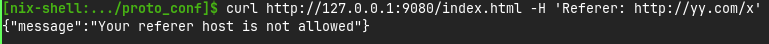

#### Consumer Restriction
The `consumer-restriction` Plugin enables access controls based on Consumer name, Route ID, Service ID, or Consumer Group ID. The concept of this plugin is the same as *user authentication*. It will be perfect if you combine it with auth plugins.

- Configuration
1. Create a consumer
```bash
curl "http://127.0.0.1:9180/apisix/admin/consumers" -X PUT \
  -H "X-API-KEY: ${admin_key}" \
  -d '{
    "username": "<consumer-name>"
  }'
```
2. Create consumer's auth
```bash
curl "http://127.0.0.1:9180/apisix/admin/consumers/JohnDoe/credentials" -X PUT \
  -H "X-API-KEY: ${admin_key}" \
  -d '{
    "id": "<consumer-auth-cred>",
    "plugins": {
      "key-auth": {
        "key": "<consumer-key>"
      }
    }
  }'
```

3. Create a Route with Key Auth
```bash
curl "http://127.0.0.1:9180/apisix/admin/routes" -X PUT   -H "X-API-KEY: ${admin_key}"   -d '{
    "id": "consumer-restricted-route",
    "uri": "/get-consume",
    "plugins": {
      "key-auth": {},
      "consumer-restriction": {
        "whitelist": [<consumer-username>]
      }
    },
    "upstream" : {
      "nodes": {
        "httpbin.org":1
      }
    }
  }'
```

- Test
Allowed Consumer
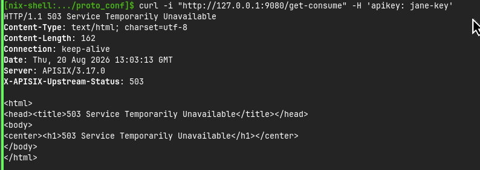

Not-Allowed Consumer
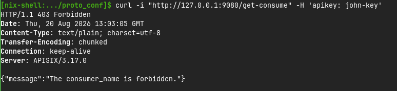

#### CSRF 
The `csrf` Plugin can be used to protect your API against CSRF attacks using the Double Submit Cookie method.

This Plugin considers the GET, HEAD and OPTIONS methods to be safe operations (safe-methods) and such requests are not checked for interception by an attacker. Other methods are termed as unsafe-methods

- Configuration
```bash
curl -i http://127.0.0.1:9180/apisix/admin/routes/1 -H "X-API-KEY: $admin_key" -X PUT-d '
{
  "uri": "/<uri>",
  "plugins": {
    "csrf": {
      "key": "<csrf-secret-key>"
    }
  },
  "upstream": {
    "type": "roundrobin",
    "nodes": {
      "<upstream-server>": 1
    }
  }
}'
```
- Get CSRF
```bash
curl -i http://127.0.0.1:9080/<uri>
```
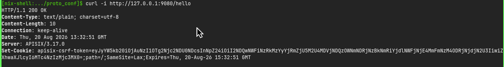

- Test
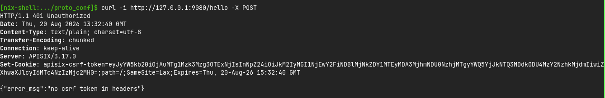


### Traffic Plugins
Plugin that focusing on request access gateway. Not like security, it's more like to **control** how it should behave.

#### Limit Req
The `limit-req` Plugin uses the leaky bucket algorithm to rate limit the number of the requests and allow for throttling. Supporting local rate and redis-based rate limiting. It can also be combined with other plugins.
- Simple Configuration
```bash
curl "http://127.0.0.1:9180/apisix/admin/routes" -X PUT \
  -H "X-API-KEY: ${admin_key}" \
  -d '
  {
    "id": "<id-route>",
    "uri": "/<uri>",
    "plugins": {
      "limit-req": {
        "rate": 1,
        "burst": 0,
        "key": "remote_addr",
        "key_type": "var",
        "rejected_code": 429,
        "policy": "local",
        "nodelay": true
      }
    },
    "upstream": {
      "type": "roundrobin",
      "nodes": {
        "<upstream-server>": 1
      }
    }
  }'
```
- Result
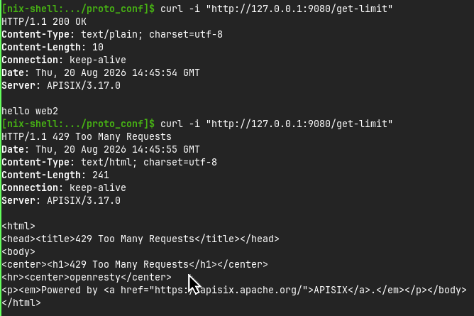

#### Limit Conn
The `limit-conn` plugin limits the rate of requests by the number of concurrent connections. Requests exceeding the threshold will be delayed or rejected based on the configuration, ensuring controlled resource usage and preventing overload.

- Configuration
```bash
curl "http://127.0.0.1:9180/apisix/admin/routes" -X PUT \
  -H "X-API-KEY: ${admin_key}" \
  -d '{
    "id": "<id-route>",
    "uri": "/<uri>",
    "plugins": {
      "limit-conn": {
        "conn": 2,
        "burst": 1,
        "default_conn_delay": 0.1,
        "key_type": "var",
        "key": "remote_addr",
        "policy": "local",
        "rejected_code": 429
      }
    },
    "upstream": {
      "type": "roundrobin",
      "nodes": {
        "<upstream-server>": 1
      }
    }
  }'
```
- Result
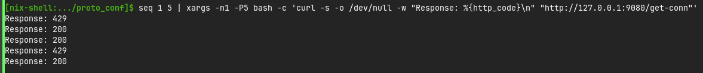

#### Limit Count 
The `limit-count` plugin uses a fixed window algorithm to limit the rate of requests by the number of requests within a given time interval. Requests exceeding the configured quota will be rejected.

- Configuration
```bash
curl "http://127.0.0.1:9180/apisix/admin/routes" -X PUT \
  -H "X-API-KEY: ${admin_key}" \
  -d '{
    "id": "<route-id>",
    "uri": "/<uri>",
    "plugins": {
      "limit-count": {
        "count": 1,
        "time_window": 30,
        "rejected_code": 429,
        "key_type": "var",
        "key": "remote_addr",
        "policy": "local"
      }
    },
    "upstream": {
      "type": "roundrobin",
      "nodes": {
        "<upstream-server>": 1
      }
    }
  }'
```
- Result
If you use `limit-count`, then client will have quota to request. They won't be able to request for several times if they reached its limit
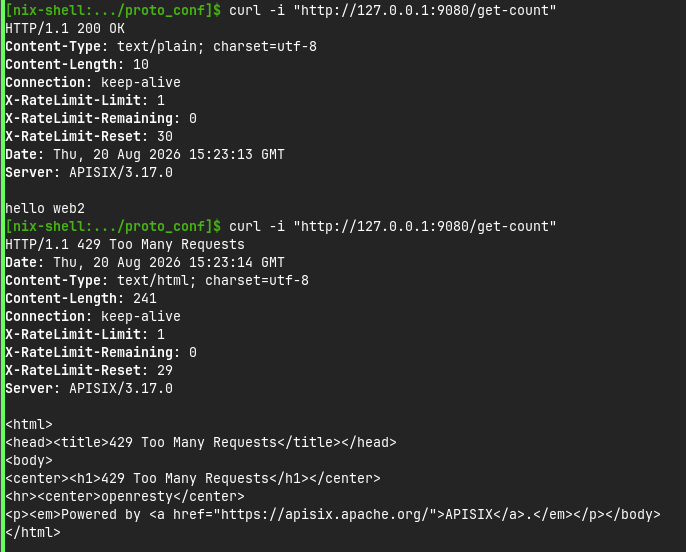

#### Proxy Cache
The `proxy-cache` Plugin provides the capability to cache responses based on a cache key. The Plugin supports both disk-based and memory-based caching options to cache for *GET*, *POST*, and *HEAD* requests.

- Configuration
1. Customize the corresponding configuration in `config.yaml`. Here's the example

2. Create config for its routes
```bash
curl "http://127.0.0.1:9180/apisix/admin/routes" -X PUT \
  -H "X-API-KEY: ${admin_key}" \
  -d '{
    "id": "<route-id>",
    "uri": "/<uri>",
    "plugins": {
      "proxy-cache": {
        "cache_strategy": "disk"
      }
    },
    "upstream": {
      "type": "roundrobin",
      "nodes": {
        "<upstream-server>": 1
      }
    }
  }'
```
- Test
1. First Test
No cache
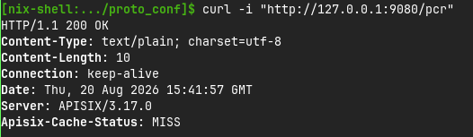

2. Second Test
Valid cache
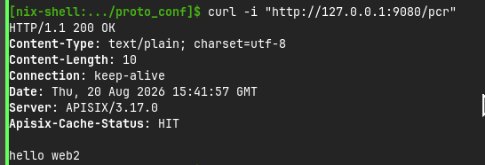

3. Third Test
Expired cache
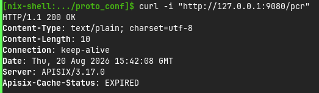