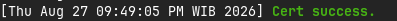
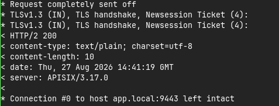

# Auto TLS Configuration
Auto-TLS means the automated creation, deployment, and management of Transport Layer Security (TLS). With this, the TLS of our services will be generated automatically. There many ways to do it, you may use this documentation way or others.

## `acme.sh`
As for this documentation, we are using `acme.sh` for our Auto-TLS. **WHY?** There are many reason why we use it. Here are the list :

1. Pure shell, without any heavy dependency. This tool only use bash without any programming languages
2. Integrate with APISIX. It has `--renew-hook` natively, with this we can set the certicate directly using `curl` to APISIX and it'll be saved in `etcd`
3. No strict infrastucture. We don't have to use or change our infrastucture just to have Auto-TLS

### Configuration
Now, we can start the configuration. Before that, there are some tools you must installed it firts.
>**REMEMBER!** You may use other configuration and doesn't have to follow it. If you want to follow our configuration, then follow all of this configuration
#### Prerequire
1. `acme-sh`, the main tool to used
2. `curl`, tools to update APISIX TLS

#### Setup
0. Set `pebble` (If you don't have any DNS)

Because `acme.sh` need to verify the domain, we need to set a DNS first. If you don't have any DNS, you can use `pebble` for testing purpose. You can follow this [documentation](https://github.com/letsencrypt/pebble). For simple, you can use `docker` to create it. Create a `docker-compose.yaml` file and add this configuration:

```yaml
pebble:
    image: ghcr.io/letsencrypt/pebble:latest
    command: ["-config", "test/config/pebble-config.json"]
    environment:
      - PEBBLE_VA_NOSLEEP=1
    ports:
      - "14000:14000"
      - "15000:15000"
```

You may use our `docker-compose.yaml` file in this repository. After that, run this command to start the `pebble`:

```bash
cd conf/

docker compose -p docker-apisix up -d pebble
```

1. Open your connection

Because `acme.sh` need to verify the domain, we need to open our connection first. Open the specific port that can be accessed by `acme.sh`. If you are using `pebble`, you can open the port `15000` and `14000`. You can use this command to open the port:

```bash
sudo ufw allow 15000
sudo ufw allow 14000
sudo ufw reload
```

If you use the same configuration as us, you can add this command to open the port:

```bash
sudo ufw allow 5002/tcp
sudo ufw allow in on docker0
sudo ufw reload
```

If you are using `nixos`, you can use this configuration in your `configuration.nix` file and rebuild it

```nix
networking.firewall.allowedTCPPorts = [ 5002 ];
networking.firewall.allowedInterfaces = [ "docker0" ];  
```

2. Create hook script

Here is the hook script that we will use to update the TLS in APISIX. You may name it whatever you want, but in this documentation, we will name it `apisix-hook.sh`. You can create it using this command:

```bash apisix-hook.sh
#!/usr/bin/env bash

CERT_PATH="$1"
KEY_PATH="$2"

APISIX_ADMIN_URL="${APISIX_ADMIN_URL:-http://127.0.0.1:9180}"
APISIX_ADMIN_KEY="${APISIX_ADMIN_KEY:-edd1c9f034335f136f87ad84b625c8f1}"
DOMAIN_NAME="${DOMAIN_NAME:-app.local}"
SSL_ID="${SSL_ID:-1}"

CERT=$(cat "$CERT_PATH" | sed ':a;N;$!ba;s/\n/\\n/g')
KEY=$(cat "$KEY_PATH" | sed ':a;N;$!ba;s/\n/\\n/g')

curl -i "$APISIX_ADMIN_URL/apisix/admin/ssls/$SSL_ID" \
  -H "X-API-KEY: $APISIX_ADMIN_KEY" \
  -X PUT -d "{
    \"snis\": [\"$DOMAIN_NAME\"],
    \"cert\": \"$CERT\",
    \"key\": \"$KEY\"
  }"
```

3. Register your ACME account

Now, we can register our ACME account using this command:
```bash
acme.sh --register-account -m $EMAIL@$DOMAIN \
  --server "$ACME_SERVER_URL" \
  --insecure \
```
>**NOTE**: use `--insecure` because we are using `pebble` for testing purpose. If you are using production, you can remove this option.

4. Issue the certificate

Now, we can issue the certificate using this command:
```bash
acme.sh --issue -d "$DOMAIN_NAME" \
  --standalone \
  --httpport "$HTTP_PORT" \
  --server "$ACME_SERVER_URL" \
  --insecure \
  --force \
  --renew-hook "./deploy-apisix.sh %CERT% %KEY%"
```
>**NOTE**: use `--insecure` because we are using `pebble` for testing purpose. If you are using production, you can remove this option.

#### Test the Auto-TLS
First, make sure the result of the certificate is success like this:



Now, we can test the Auto-TLS using this command:

```bash
curl https://<NAMA_DOMAIN>/<ENDPOINT_PATH>
```

If you use `pebble` locally, you may use this command to test it:

```bash
curl -vk --resolve <NAMA_DOMAIN>:<PORT_HTTPS_APISIX>:127.0.0.1 https://<NAMA_DOMAIN>:<PORT_HTTPS_APISIX>/<ENDPOINT_PATH>
```

You may see the result like this, with different date :



