# General

Category reference: https://apisix.apache.org/plugins/#General

Plugins reviewed in this category: `batch-requests`, `redirect`, `echo`, `real-ip`, `server-info`, `gzip`.

> Note: the Real-IP review below also uses `response-rewrite` to verify that Real-IP is working. `response-rewrite` itself belongs to the Transformation category on the official Plugin Hub, but it is kept together with Real-IP here since both were configured and tested in the same step.

[⬅ Back to progress overview](../README.md)

---

## Batch Requests
The Batch Requests is a plugin that used for requesting some data at the same time. It's so useful for client. Because of it, client doesn't have to open many HTTP Requests, reduce its latency, and handshake TLS. However, in APISIX side, it's still receiving all requests. It can also be more heavier.
- Config
```bash
curl http://127.0.0.1:9180/apisix/admin/plugin_metadata/batch-requests -H "X-API-KEY: $admin_key" -X PUT -d '
{
    "max_body_size": 4194304
}'
# to publish publicly
curl http://127.0.0.1:9180/apisix/admin/routes/br -H "X-API-KEY: $admin_key" -X PUT -d '
{
    "uri": "/apisix/batch-requests",
    "plugins": {
        "public-api": {}
    }
}'
```
- Result

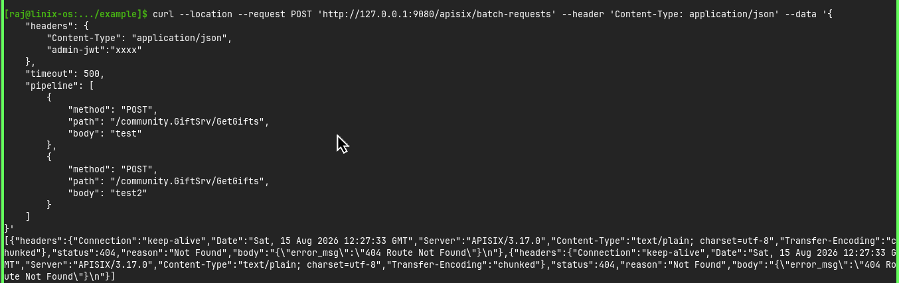

[Source documentation](https://apisix.apache.org/docs/apisix/plugins/batch-requests/)
## Redirect
As the name, the focus of this plugin is for redirecting. But, this is more than regular redirect. It can redirect from http to https, can redirecting to different domain, and can even set read regex if client type or anything. 

- Before Redirect
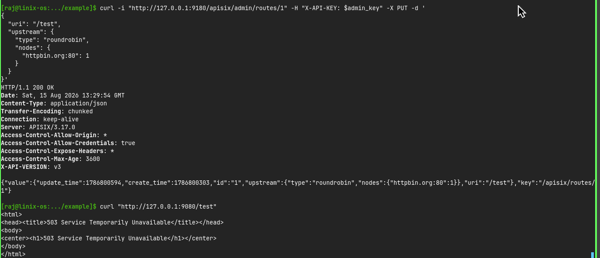
- After Redirect
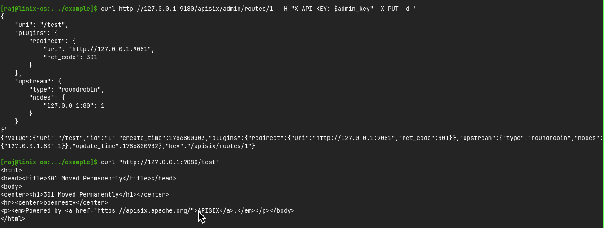

[Source documentation](https://apisix.apache.org/docs/apisix/plugins/redirect/)

## Echo

Similar to the `echo` command in CLI, this plugin helps return additional information in the response when making a request.

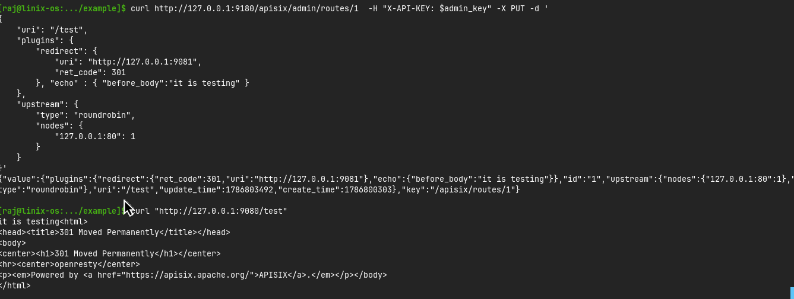

[Source documentation](https://apisix.apache.org/docs/apisix/plugins/echo/)

## Real-IP && Response-Rewrite
Real-IP is used to create same IP address for clients to identify them. With it, we can now know from which client the Requests came. **Why?** Because there is cases when we needed to really know them. 

Response Rewrite is to edit or create additional information from response. **WHY WITH REAL-IP?** Because we wanna know is the Real-IP really works or not. If we didn't use it, then we can not possibly know it's really change the IP or not. For that, we can use this plugin for debugging.

```bash
curl "http://127.0.0.1:9180/apisix/admin/routes/real-ip-route" \ 
  -X PATCH \
  -H "X-API-KEY: ${admin_key}" \ 
  -d '{
    "plugins": {
      "real-ip": {
        "source": "arg_realip",
        "trusted_addresses": [
          <legal-proxy-ip-to-inform>
        ]
      },
      "response-rewrite": {
        "headers": {
          "remote_addr": "$remote_addr",
          "remote_port": "$remote_port"
        }
      }
    }
  }'
#   Remote addr and port is for revealing the Real-IP

```
- Config
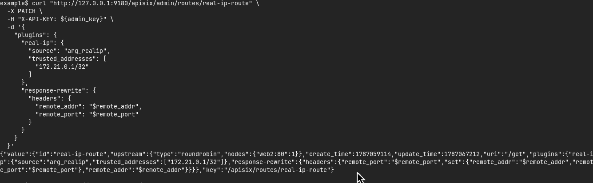
- Result
ing
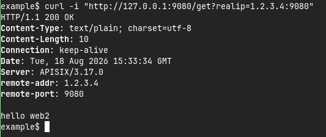

## Server Info
Used to periodically reports basic server information to etcd. The most importantly, to recap it. For the rest, will be informed later.


## Server Info
### The configuration
1. Set it in config.yaml

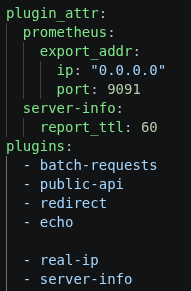

2. Activate control API in APISIX

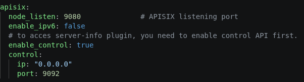

### Test Result
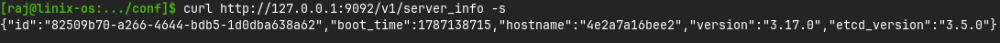
## Gzip
It's used to minimize a big responses. Same as, zip command in file manager. However, it's oriented in response and client should have to set `Accept-Encoding` header first to use it.

### Configuration
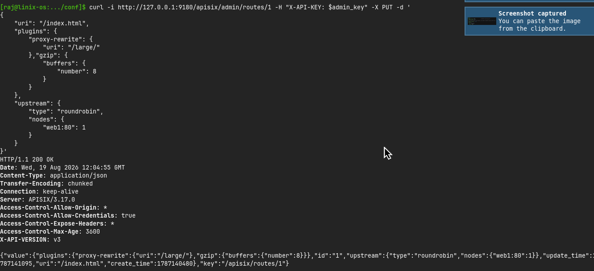
### Test Result
- Before
Only base response

- After
Can change it to zip if it's too big
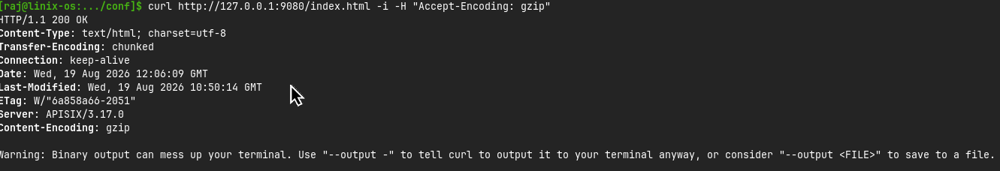

