# Traffic

Category reference: https://apisix.apache.org/plugins/#Traffic

Plugins reviewed in this category: `limit-req`, `limit-conn`, `limit-count`, `proxy-cache`, `request-validation`, `proxy-mirror`, `api-breaker`, `traffic-split`, `request-id`, `proxy-control`, `client-control`.

[⬅ Back to progress overview](../README.md)

---

## Traffic Plugins
Plugin that focusing on request access gateway. Not like security, it's more like to **control** how it should behave.

### Limit Req
The `limit-req` Plugin uses the leaky bucket algorithm to rate limit the number of the requests and allow for throttling. Supporting local rate and redis-based rate limiting. It can also be combined with other plugins.
- Simple Configuration
```bash
curl "http://127.0.0.1:9180/apisix/admin/routes" -X PUT \
  -H "X-API-KEY: ${admin_key}" \
  -d '
  {
    "id": "<id-route>",
    "uri": "/<uri>",
    "plugins": {
      "limit-req": {
        "rate": 1,
        "burst": 0,
        "key": "remote_addr",
        "key_type": "var",
        "rejected_code": 429,
        "policy": "local",
        "nodelay": true
      }
    },
    "upstream": {
      "type": "roundrobin",
      "nodes": {
        "<upstream-server>": 1
      }
    }
  }'
```
- Result


### Limit Conn
The `limit-conn` plugin limits the rate of requests by the number of concurrent connections. Requests exceeding the threshold will be delayed or rejected based on the configuration, ensuring controlled resource usage and preventing overload.

- Configuration
```bash
curl "http://127.0.0.1:9180/apisix/admin/routes" -X PUT \
  -H "X-API-KEY: ${admin_key}" \
  -d '{
    "id": "<id-route>",
    "uri": "/<uri>",
    "plugins": {
      "limit-conn": {
        "conn": 2,
        "burst": 1,
        "default_conn_delay": 0.1,
        "key_type": "var",
        "key": "remote_addr",
        "policy": "local",
        "rejected_code": 429
      }
    },
    "upstream": {
      "type": "roundrobin",
      "nodes": {
        "<upstream-server>": 1
      }
    }
  }'
```
- Result


### Limit Count 
The `limit-count` plugin uses a fixed window algorithm to limit the rate of requests by the number of requests within a given time interval. Requests exceeding the configured quota will be rejected.

- Configuration
```bash
curl "http://127.0.0.1:9180/apisix/admin/routes" -X PUT \
  -H "X-API-KEY: ${admin_key}" \
  -d '{
    "id": "<route-id>",
    "uri": "/<uri>",
    "plugins": {
      "limit-count": {
        "count": 1,
        "time_window": 30,
        "rejected_code": 429,
        "key_type": "var",
        "key": "remote_addr",
        "policy": "local"
      }
    },
    "upstream": {
      "type": "roundrobin",
      "nodes": {
        "<upstream-server>": 1
      }
    }
  }'
```
- Result

If you use `limit-count`, then client will have quota to request. They won't be able to request for several times if they reached its limit


### Proxy Cache
The `proxy-cache` Plugin provides the capability to cache responses based on a cache key. The Plugin supports both disk-based and memory-based caching options to cache for *GET*, *POST*, and *HEAD* requests.

- Configuration
1. Customize the corresponding configuration in `config.yaml`. Here's the example

2. Create config for its routes
```bash
curl "http://127.0.0.1:9180/apisix/admin/routes" -X PUT \
  -H "X-API-KEY: ${admin_key}" \
  -d '{
    "id": "<route-id>",
    "uri": "/<uri>",
    "plugins": {
      "proxy-cache": {
        "cache_strategy": "disk"
      }
    },
    "upstream": {
      "type": "roundrobin",
      "nodes": {
        "<upstream-server>": 1
      }
    }
  }'
```
- Result

1. First Test
No cache


2. Second Test
Valid cache


3. Third Test
Expired cache


## 22nd August 2026
Continue reviewing plugins. The main focus is the rest of Traffic Plugins. 

## Traffic Plugins
### Request Validation
The `request-validation` Plugin validates requests before forwarding them to Upstream services. This Plugin uses **JSON Schema** for validation and can validate headers and body of a request.

- Configuration
1. Header Validation

Edit `header_schema` attribute

```bash
curl "http://127.0.0.1:9180/apisix/admin/routes" -X PUT \
  -H "X-API-KEY: ${admin_key}" \
  -d '{
    "id": "<route-id>",
    "uri": "/<uri>",
    "plugins": {
      "request-validation": {
        "header_schema": {
          "type": "object",
          "required": ["User-Agent", "Host"],
          "properties": {
            "User-Agent": {
              "type": "string",
              "pattern": "^curl\/"
            },
            "Host": {
              "type": "string",
              "enum": ["httpbin.org", "httpbin"]
            }
          }
        }
      }
    },
    "upstream": {
      "type": "roundrobin",
      "nodes": {
        "httpbin.org:80": 1
      }
    }
  }'
```

2. Customize Rejection Message and Status Code

Edit `rejected_code` and `rejected_msg` attribute.

```bash
curl "http://127.0.0.1:9180/apisix/admin/routes" -X PUT \
  -H "X-API-KEY: ${admin_key}" \
  -d '{
    "id": "<route-id>",
    "uri": "/<uri>",
    "plugins": {
      "request-validation": {
        "header_schema": {
          "type": "object",
          "required": ["Host"],
          "properties": {
            "Host": {
              "type": "string",
              "enum": ["httpbin.org", "httpbin"]
            }
          }
        },
        "rejected_code": 403,
        "rejected_msg": "Request header validation failed."
      }
    },
    "upstream": {
      "type": "roundrobin",
      "nodes": {
        "httpbin.org:80": 1
      }
    }
  }'
```

3. Body Validation

Edit `body_schema` attribute.

```bash
curl "http://127.0.0.1:9180/apisix/admin/routes" -X PUT \
  -H "X-API-KEY: ${admin_key}" \
  -d '{
    "id": "<route-id>",
    "uri": "/<uri>",
    "plugins": {
      "request-validation": {
        "header_schema": {
          "type": "object",
          "required": ["Content-Type"],
          "properties": {
            "Content-Type": {
            "type": "string",
            "pattern": "^application\/json$"
            }
          }
        },
        "body_schema": {
          "type": "object",
          "required": ["required_payload"],
          "properties": {
            "required_payload": {"type": "string"},
            "boolean_payload": {"type": "boolean"},
            "array_payload": {
              "type": "array",
              "minItems": 1,
              "items": {
                "type": "integer",
                "minimum": 200,
                "maximum": 599
              },
              "uniqueItems": true,
              "default": [200]
            }
          }
        }
      }
    },
    "upstream": {
      "type": "roundrobin",
      "nodes": {
        "httpbin.org:80": 1
      }
    }
  }'
```

- Result
1. Header Validation

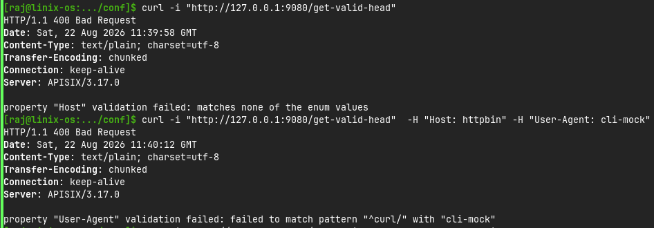

2. Custom Message and Code

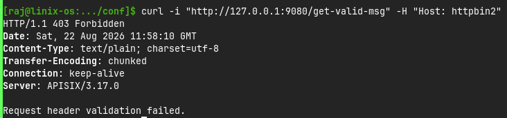

3. Body Validation

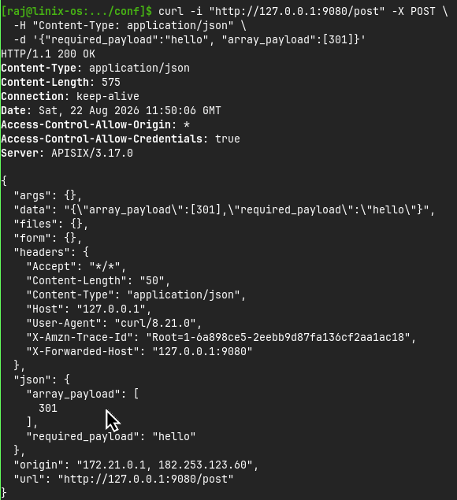


### Proxy Mirror
The `proxy-mirror` plugin duplicates ingress traffic to APISIX and forwards them to a designated upstream, without interrupting the regular services. You can configure the plugin to mirror all traffic or only a portion. The mechanism benefits a few use cases, including troubleshooting, security inspection, analytics, and more.

- Configuration

1. Static configuration

By default, timeout values for the plugin are pre-configured in the **default configuration**.

To customize these values, add the corresponding configurations to `config.yaml`. For example:
```yaml
plugin_attr:
  proxy-mirror:
    timeout:
      connect: 60s
      read: 60s
      send: 60s
```


2. Route configuration

```bash
curl "http://127.0.0.1:9180/apisix/admin/routes" -X PUT \
  -H "X-API-KEY: ${admin_key}" \
  -d '{
    "id": "<route-id>",
    "uri": "/<uri>",
    "plugins": {
      "proxy-mirror": {
        "host": "<your-mirror-service>",
        "sample_ratio": 0.5
      }
    },
    "upstream": {
      "nodes": {
        "httpbin.org": 1
      },
      "type": "roundrobin"
    }
  }'
```

- Result

This suggests APISIX has mirrored the request to the NGINX server. Here, the HTTP response status is 404 since the sample NGINX server does not implement the Route.

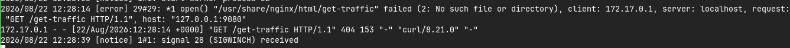


### API Breaker
The `api-breaker` Plugin implements circuit breaker functionality to protect Upstream services. Would be useful if our backend services suddenly error, this plugin will handle the client to not reach the backend before it's fixed.

- Configuration
```bash
curl "http://127.0.0.1:9180/apisix/admin/routes/<route-id>" \
-H "X-API-KEY: $admin_key" -X PUT -d '
{
    "plugins": {
        "api-breaker": {
            "break_response_code": 502,
            "unhealthy": {
                "http_statuses": [500, 503],
                "failures": 3
            },
            "healthy": {
                "http_statuses": [200],
                "successes": 1
            }
        }
    },
    "upstream": {
        "type": "roundrobin",
        "nodes": {
            "<upstream-service>": 1
        }
    },
    "uri": "/<uri>"
}'
```

- Result

After 3 times result of error, it'll be 502

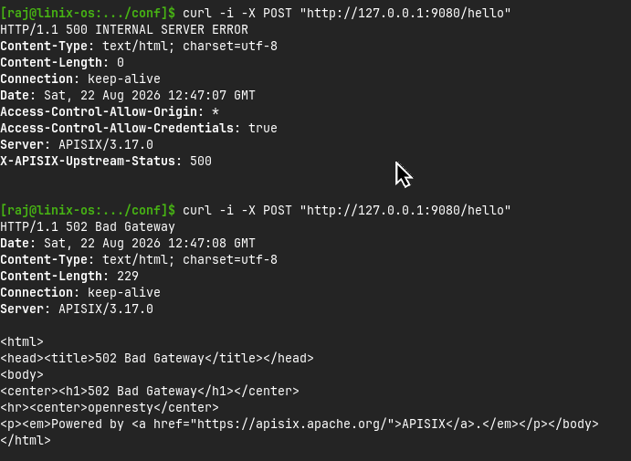

### Traffic Split
The `traffic-split` Plugin directs traffic to various Upstream services based on conditions and/or weights. It provides a dynamic and flexible approach to implement release strategies and manage traffic. The difference between this and `load balancer` is this plugin doesn't have to share same weights or conditions. Can be used for a **Blue-Green Deployment** and **Canary Developmen**

#### Configuration
1. Canary Deployment Configuration

Weight based split configuration

```bash
curl "http://127.0.0.1:9180/apisix/admin/routes" -X PUT \
  -H "X-API-KEY: ${admin_key}" \
  -d '{
    "uri": "/<uri>",
    "id": "<route-id>",
    "plugins": {
      "traffic-split": {
        "rules": [
          {
            "weighted_upstreams": [
              {
                "upstream": {
                  "type": "roundrobin",
                  "scheme": "https",
                  "pass_host": "node",
                  "nodes": {
                    "<second-service>":1
                  }
                },
                "weight": 3
              },
              {
                "weight": 2
              }
            ]
          }
        ]
      }
    },
    "upstream": {
      "type": "roundrobin",
      "scheme": "https",
      "pass_host": "node",
      "nodes": {
        "<first-service>":1
      }
    }
  }'
```

2. Blue-Green Deployment Configuration

Condition based split configuration

```bash
curl "http://127.0.0.1:9180/apisix/admin/routes" -X PUT \
  -H "X-API-KEY: ${admin_key}" \
  -d '{
    "uri": "/<uri>>",
    "id": "<route-id>",
    "plugins": {
      "traffic-split": {
        "rules": [
          {
            "match": [
              {
                "vars": [
                  ["http_release","==","new_release"]
                ]
              }
            ],
            "weighted_upstreams": [
              {
                "upstream": {
                  "type": "roundrobin",
                  "scheme": "https",
                  "pass_host": "node",
                  "nodes": {
                    "<second-service>":1
                  }
                }
              }
            ]
          }
        ]
      }
    },
    "upstream": {
      "type": "roundrobin",
      "scheme": "https",
      "pass_host": "node",
      "nodes": {
        "<first-service>":1
      }
    }
  }'
```

#### Test
1. Canary Deployment Configuration

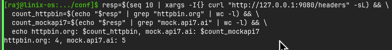

2. Blue-Green Deployment Configuration

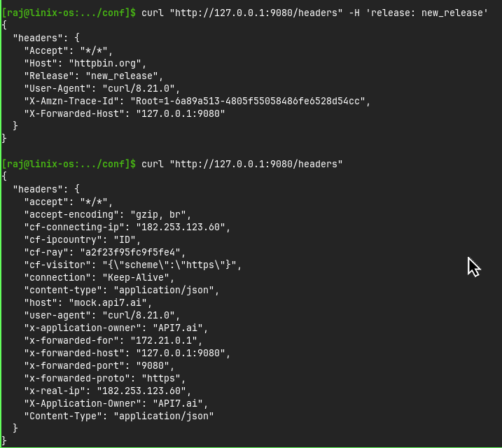

### Request ID
The `request-id` Plugin assigns a unique ID to each request proxied through the gateway, which can be used for request tracking and debugging. If a request already includes an ID in the header specified by header_name and the value is not empty (""), the plugin uses that value as the request ID. Otherwise, it generates a new one and does not overwrite a valid existing ID

- Configuration

```bash
curl "http://127.0.0.1:9180/apisix/admin/routes" -X PUT \
  -H "X-API-KEY: ${admin_key}" \
  -d '{
    "id": "<route-id>",
    "uri": "/<uri>",
    "plugins": {
      "request-id": {
        "header_name": "X-Request-Id",
        "include_in_response": true,
        "algorithm": "uuid"
      }
    },
    "upstream": {
      "type": "roundrobin",
      "nodes": {
        "<upstream-service>": 1
      }
    }
  }'
```

- Result

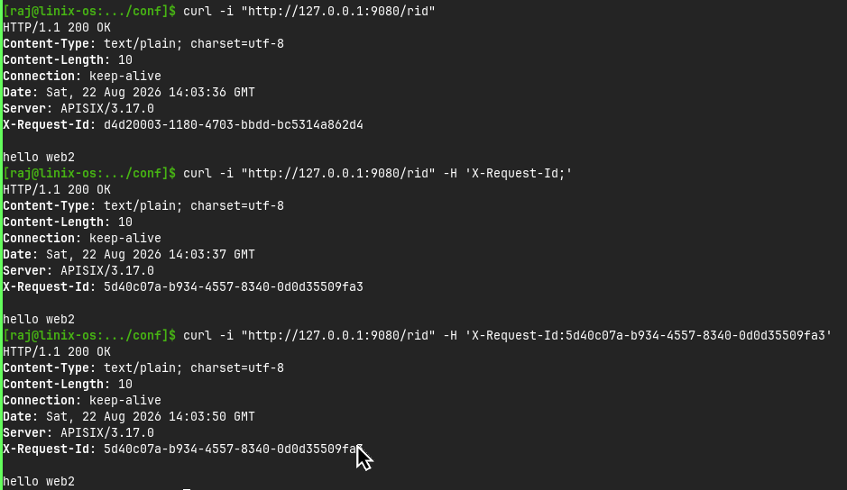

### Proxy Control
The `proxy-control` Plugin dynamically controls the behavior of the NGINX proxy, especially to control its request whether continue to upstream or not.

- Configuration

```bash
curl -i http://127.0.0.1:9180/apisix/admin/routes/<route-id> -H "X-API-KEY: $admin_key" \ 
  -X PUT -d '
{
    "uri": "/<uri>",
    "plugins": {
        "proxy-control": {
            "request_buffering": false
        }
    },
    "upstream": {
        "type": "roundrobin",
        "nodes": {
            "<upstream-service>": 1
        }
    }
}'
```
- Result

Test command
```bash
curl -i http://127.0.0.1:9080/uri -d @<very-big-file>
```

Before

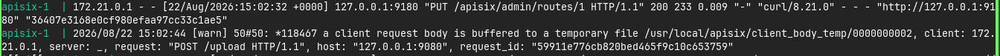

After

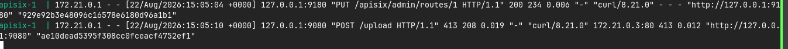

### Client Control
The `client-control` Plugin can be used to dynamically control the behavior of NGINX to handle a client request, by setting the max size of the request body.

- Configuration

```bash
curl -i http://127.0.0.1:9180/apisix/admin/routes/<route-id> \ 
  -H "X-API-KEY: $admin_key" -X PUT -d '
{
    "uri": "/<uri>",
    "plugins": {
        "client-control": {
            "max_body_size" : 1
        }
    },
    "upstream": {
        "type": "roundrobin",
        "nodes": {
            "<upstream-service>": 1
        }
    }
}'
```

- Result

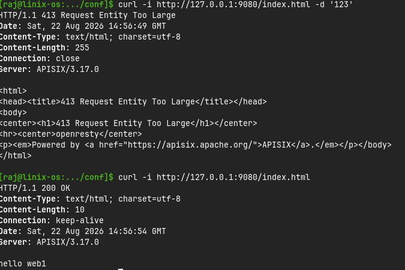


