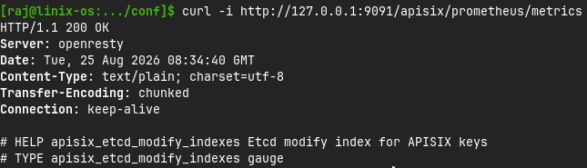
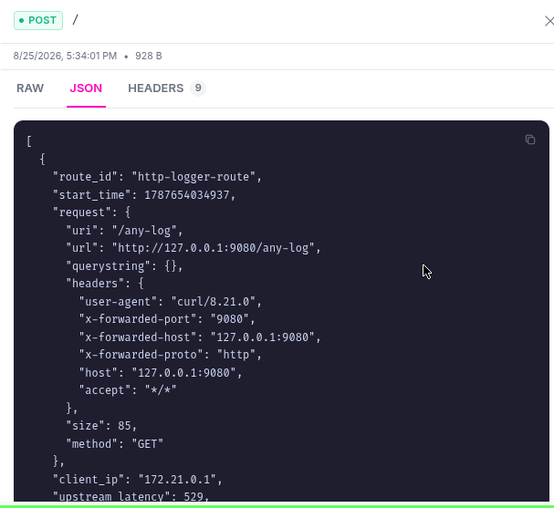
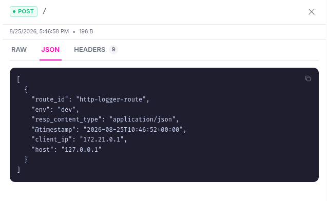
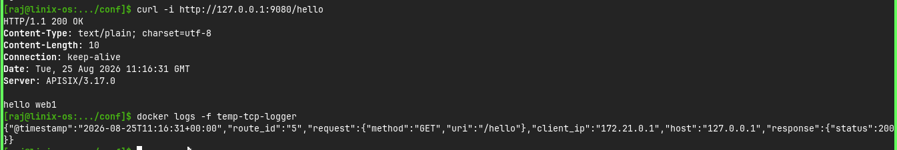
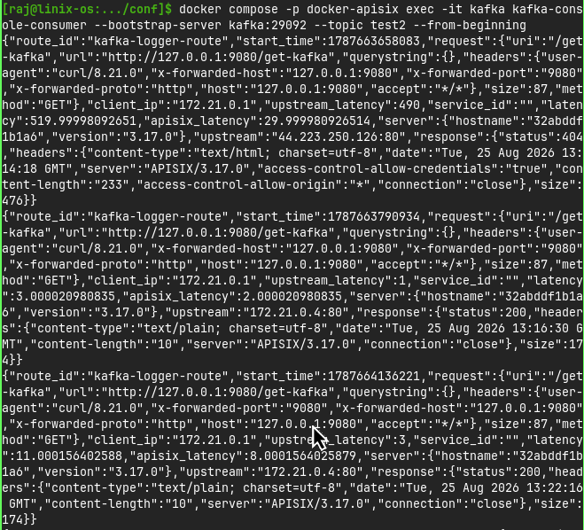
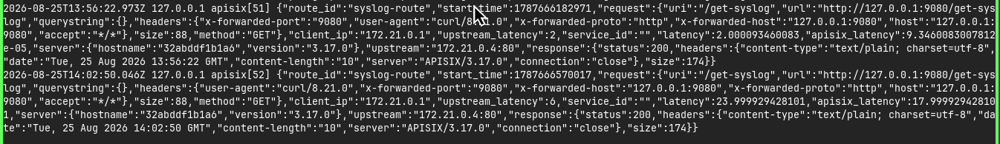
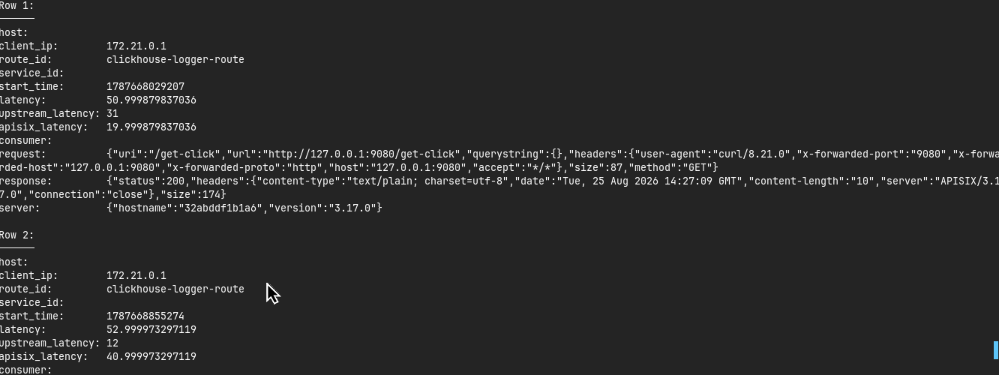
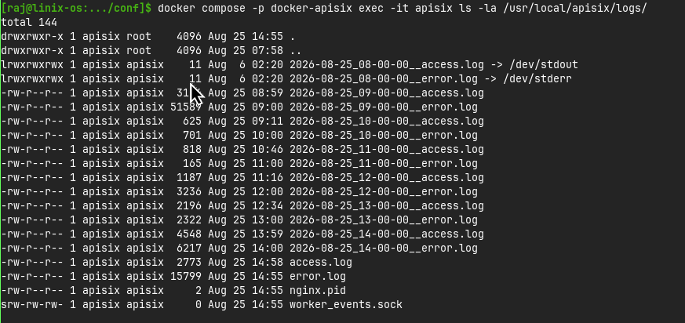

# Observability

Category reference: https://apisix.apache.org/plugins/#Observability

Plugins reviewed in this category: `prometheus`, `http-logger`, `tcp-logger`, `kafka-logger`, `syslog`, `clickhouse-logger`, `log-rotate`.

[⬅ Back to progress overview](../README.md)

---

## Observability Plugins
The plugins that can be used for observe traffic condition and behaviour, especially metrics, logs, dan traces. Here are the review of them

### Prometheus
As its name suggests, this plugin provides integration between APISIX and Prometheus. Prometheus is a monitoring system and Time-Series Database (TSDB). By combining it with APISIX, APISIX exposes traffic and system metrics, while Prometheus collects and stores them as time-series data.

#### Configuration
1. Install Prometheus Plugin
Even though the Prometheus plugin is pre-installed, you need to enable it in the `config.yaml` file. Add the following configuration under the `plugins` section:
```yaml
plugins:
  - name: prometheus
```

2. Set Static Configuration
The plugin is pre-configured by default. The main configuration is available under `plugin_attr.prometheus`:

```yaml
plugin_attr:
  prometheus:
    export_uri: /apisix/prometheus/metrics
    metric_prefix: apisix_
    enable_export_server: true
```
- export_uri — endpoint used to expose metrics.
- metric_prefix — prefix added to APISIX metrics.
- enable_export_server — enables the metrics export server.
- For basic usage, the default configuration is sufficient.

3. Set Prometheus Configuration (optional)
It's optional but if you want to customize Prometheus configuration, you can edit the `prometheus.yml` file. Here's an example configuration:
```yaml
global:
  scrape_interval: 1s     # By default, scrape targets every 15 seconds.
  external_labels:
    stack: "apisix"

# A scrape configuration containing exactly one endpoint to scrape:
scrape_configs:
  - job_name: "prometheus"
    # Override the global default and scrape targets from this job every 5 seconds.
    scrape_interval: 5s
    static_configs:
      - targets: ["localhost:9090"]
  - job_name: "apisix"
    scrape_interval: 5s
    metrics_path: "/apisix/prometheus/metrics"
    static_configs:
      - targets: ["apisix:9091"]
```

#### Test
**Is it really working?** If you wanna know it, you don't have to create complex configuration just to test it. You can just use this command bellow
```bash
curl -i http://127.0.0.1:9091/apisix/prometheus/metrics
```

As for the success result, should at least has these first output as result



After that, you may configure your APISIX and Prometheus with your own configuration


### HTTP Logger
The `http-logger` Plugin pushes request and response logs as JSON objects to HTTP(S) servers in batches and supports the customization of log formats.

#### Configuration
1. Default log format
The default log format only use route configuration
```bash
curl "http://127.0.0.1:9180/apisix/admin/routes" -X PUT \
  -H "X-API-KEY: ${admin_key}" \
  -d '{
    "id": "<route-id>",
    "uri": "/<uri>",
    "plugins": {
      "http-logger": {
        "uri": "<external-service>"
      }
    },
    "upstream": {
      "nodes": {
        "<upstream-service>": 1
      },
      "type": "roundrobin"
    }
  }'
```

2. Meta Data Configuration
Here is the example if you want to configure its request and response in meta data
```bash
curl "http://127.0.0.1:9180/apisix/admin/plugin_metadata/http-logger" -X PUT \
  -H "X-API-KEY: ${admin_key}" \
  -d '{
    "log_format": {
      "host": "$host",
      "@timestamp": "$time_iso8601",
      "client_ip": "$remote_addr",
      "env": "$http_env",
      "resp_content_type": "$sent_http_Content_Type"
    }
  }'
```

3. Log Request Bodies Conditionally
You may create a condition whether a requests go to log or not. Here's the example
```bash
curl "http://127.0.0.1:9180/apisix/admin/routes" -X PUT \
  -H "X-API-KEY: ${admin_key}" \
  -d '{
    "id": "<route-id>",
    "uri": "/<uri>",
    "plugins": {
      "http-logger": {
        "uri": "<external-log-service>",
        "include_req_body": true,
        "include_req_body_expr": [["arg_log_body", "==", "yes"]]
      }
    },
    "upstream": {
      "nodes": {
        "<upstream-service>": 1
      },
      "type": "roundrobin"
    }
  }'
```

#### Test
As for the test, you can just access it logs from your external service. In this documentation, we are using *Mockbin*
1. Default Log Format



2. Meta Data Configuration



### TCP Logger
The `tcp-logger` Plugin can be used to push log data requests to TCP servers.

This provides the ability to send log data requests as JSON objects to monitoring tools and other TCP servers.

This plugin also allows to push logs as a batch to your external TCP server. It might take some time to receive the log data. It will be automatically sent after the timer function in the batch processor expires.

#### Configuration
1. Set meta data configuration
Same as `http-logger`, you may config it like example below
```bash
curl http://127.0.0.1:9180/apisix/admin/plugin_metadata/tcp-logger -H "X-API-KEY: $admin_key" -X PUT -d '
{
  "log_format": {
    "host": "$host",
    "@timestamp": "$time_iso8601",
    "client_ip": "$remote_addr",
    "request": { "method": "$request_method", "uri": "$request_uri" },
    "response": { "status": "$status" }
  }
}'
```
2. Enable plugin in routes
```bash
curl http://127.0.0.1:9180/apisix/admin/routes/<route-id> -H "X-API-KEY: $admin_key" -X PUT -d '
{
  "plugins": {
    "tcp-logger": {
      "host": "<tcp-host>",
      "port": <tcp-port>,
      "tls": false,
      "batch_max_size": 1,
      "name": "tcp logger"
    }
    },
  "upstream": {
    "type": "roundrobin",
    "nodes": {
      "<upstream-service>": 1
    }
  },
  "uri": "/<uri>"
}'
```

#### Test
Same as `http-logger`, you may hit the url and check it from your own tcp service. As for this documentation, we use *Netcat*



### Kafka Logger
The `kafka-logger` Plugin pushes request and response logs as JSON objects to Apache Kafka clusters in batches and supports the customization of log formats.

It might take some time to receive the log data. It will be automatically sent after the timer function in the batch processor expires.

#### Configuration
1. Create and run **Kafka Service**
If you don't have any **Kafka Service** that run, the you might create it in `docker-compose.yml`
```yml
services:
  zookeeper:
    image: confluentinc/cp-zookeeper:7.8.0
    container_name: zookeeper
    environment:
      ZOOKEEPER_CLIENT_PORT: 2181
      ZOOKEEPER_TICK_TIME: 2000

  kafka:
    image: confluentinc/cp-kafka:7.8.0
    container_name: kafka
    depends_on:
      - zookeeper
    environment:
      KAFKA_BROKER_ID: 1
      KAFKA_ZOOKEEPER_CONNECT: zookeeper:2181
      KAFKA_LISTENER_SECURITY_PROTOCOL_MAP: PLAINTEXT:PLAINTEXT,PLAINTEXT_HOST:PLAINTEXT
      KAFKA_ADVERTISED_LISTENERS: PLAINTEXT://kafka:29092,PLAINTEXT_HOST://127.0.0.1:9093
      KAFKA_OFFSETS_TOPIC_REPLICATION_FACTOR: 1
      KAFKA_AUTO_CREATE_TOPICS_ENABLE: "true"
    ports:
      - "9093:9092"
```
After that, you may run it using `docker` or `docker-compose` 

2. Configure in routes
You may use it as example configuration.

```bash
curl "http://127.0.0.1:9180/apisix/admin/routes" -X PUT \
  -H "X-API-KEY: ${admin_key}" \
  -d '{
    "id": "kafka-logger-route",
    "uri": "/<uri>",
    "plugins": {
      "kafka-logger": {
        "meta_format": "default",
        "brokers": [
          {
            "host": "<kafka-host>",
            "port": <kafka-port>
          }
        ],
        "kafka_topic": "test2",
        "key": "key1",
        "batch_max_size": 1
      }
    },
    "upstream": {
      "nodes": {
        "<upstream-service>": 1
      },
      "type": "roundrobin"
    }
  }'
```

#### Test
As for test, you can see the result of the configuration in *Kafka*'s log. If you use `docker-compose.yml` configuration, you may use this command

```bash
docker compose exec -it kafka kafka-console-consumer --bootstrap-server kafka:29092 --topic test2 --from-beginning
```

As to try the command, you can just access the url you have set.

```bash
curl -i "http://127.0.0.1:9080/<uri>"
```

The result :


### Syslog
The `syslog` Plugin pushes request and response logs as JSON objects to syslog servers in batches and supports the customization of log formats.

#### Configuration
1. Make sure **Syslog** run
If you don't have *Syslog*, then you may use this command first
```bash
docker run -d -p 514:514 --name example-rsyslog-server rsyslog/syslog_appliance_alpine
```

2. Create route configuration

```bash
curl "http://127.0.0.1:9180/apisix/admin/routes" -X PUT \
  -H "X-API-KEY: ${admin_key}" \
  -d '{
    "id": "<route-id>",
    "uri": "/<uri>",
    "plugins": {
      "syslog": {
        "host" : "<syslog-host>",
        "port" : <syslog-port>,
        "flush_limit" : 1
      }
    },
    "upstream": {
      "nodes": {
        "<upstream-service>": 1
      },
      "type": "roundrobin"
    }
  }'
```

#### Test
Same as `http-logger` and `tcp-logger`, you may hit the url and check it from your own syslog service. As for this documentation, we use *Syslog* in docker.

If you use `docker` command, you can see the result using this command
```bash
docker logs example-rsyslog-server
```

Result


### Clickhouse Logger
The `clickhouse-logger` Plugin pushes request and response logs to *ClickHouse* database in batches and supports the customization of log formats.

#### Configuration
1. Make sure **Clickhouse** run
If you don't have *Clickhouse*, then you may use this command first
```bash
docker run -d -p 8123:8123 -p 9000:9000 -p 9009:9009 --name clickhouse-server -e  CLICKHOUSE_PASSWORD="<clickhouse-password>" clickhouse/clickhouse-server
```

2. Create table in **Clickhouse**
Create a table named default_logs in your ClickHouse database with columns corresponding to the default log format. You have to create an exact table with the same name and columns as the default/custom log format used by the plugin.
```bash
curl "http://127.0.0.1:8123" -X POST -d '
  CREATE TABLE default.default_logs (
    host String,
    client_ip String,
    route_id String,
    service_id String,
    start_time String,
    latency String,
    upstream_latency String,
    apisix_latency String,
    consumer String,
    request String,
    response String,
    server String
  )
  ENGINE = MergeTree()
  ORDER BY (`start_time`)
  PRIMARY KEY(`start_time`)
' --user default:<clickhouse-password>
```

3. Create route configuration

```bash
curl "http://127.0.0.1:9180/apisix/admin/routes" -X PUT \
  -H "X-API-KEY: ${admin_key}" \
  -d '{
    "id": "<route-id>",
    "uri": "/<uri>",
    "plugins": {
      "clickhouse-logger": {
        "user": "default",
        "password": "<clickhouse-password>",
        "database": "default",
        "logtable": "default_logs",
        "endpoint_addrs": ["<clickhouse-endpoint>"]
      }
    },
    "upstream": {
      "type": "roundrobin",
      "nodes": {
        "<upstream-service>": 1
      }
    }
  }'
```

#### Test
Access the route that you have made to test the log. As for the result, you may check it with this command

```bash
echo 'SELECT * FROM default.default_logs FORMAT Pretty' | curl "http://127.0.0.1:8123/?" --user default:<clickhouse-password> -d @-
```

The result will definitely shows the log with table. If you haven't access the route, then you will not see any value




### Log Rotate
The `log-rotate` Plugin is used to keep rotating access and error log files in the log directory at regular intervals.

You can configure how often the logs are rotated and how many logs to keep. When the number of logs exceeds, older logs are automatically deleted.

- Configuration
```yaml
plugin_attr:
  log-rotate:
      interval: 3600    # rotate interval (unit: second)
      max_kept: 168     # max number of log files will be kept
      max_size: -1      # max size of log files will be kept
      enable_compression: false # enable log file compression(gzip) or not, default false
```

- Test

Use this command to know the test result

```bash
ll logs
```

If you use docker like this configuration, then use this command instead

```bash
docker compose -p docker-apisix exec -it apisix ls -la /usr/local/apisix/logs/
```

Result :



