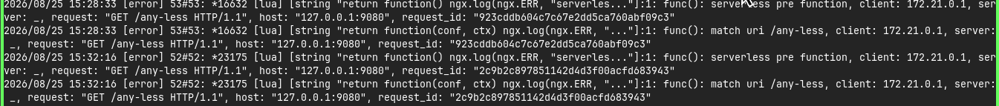

# Serverless

Category reference: https://apisix.apache.org/plugins/#Serverless

Plugins reviewed in this category: `serverless-pre-function`, `serverless-post-function`.

[⬅ Back to progress overview](../README.md)

---

## Serverless Function
The serverless functions consist of two plugins, `serverless-pre-function` and `serverless-post-function`. These plugins enable the execution of user-defined logic at the beginning and end of the execution phases the functions hook to.

1. Serverless Pre Function

The `serverless-pre-function` Plugin allows you to execute user-defined logic before the request is proxied to the upstream service. This can be useful for tasks such as request validation, authentication, or modifying request headers.

2. Serverless Post Function

The `serverless-post-function` Plugin allows you to execute user-defined logic after the response is received from the upstream service but before it is sent back to the client. This can be useful for tasks such as response transformation, logging, or adding custom headers.

- Configuration

You may use this configuration to simple try it
```bash
curl "http://127.0.0.1:9180/apisix/admin/routes" -X PUT \
  -H "X-API-KEY: ${admin_key}" \
  -d '{
    "id": "<route-id>",
    "uri": "/<uri>",
    "plugins": {
      "serverless-pre-function": {
        "phase": "rewrite",
        "functions" : [
          "return function() ngx.log(ngx.ERR, \"serverless pre function\"); end"
        ]
      },
      "serverless-post-function": {
        "phase": "rewrite",
        "functions" : [
          "return function(conf, ctx) ngx.log(ngx.ERR, \"match uri \", ctx.curr_req_matched and ctx.curr_req_matched._path); end"
        ]
      }
    },
    "upstream": {
      "type": "roundrobin",
      "nodes": {
        "<upstream-service>": 1
      }
    }
  }'
```

- Test


