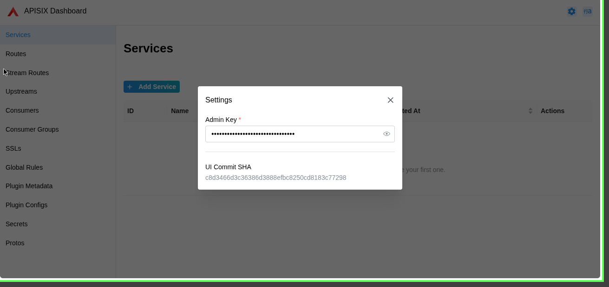
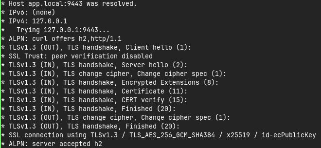

# Common Security Misconfigurations
For some missconfigurations, we can find it in the [OWASP Top 10](https://owasp.org/Top10/) list. Here are some of the common misconfigurations that we can find in our APISIX configuration and reviews

## Administrative Interfaces Exposed to the Internet
The administrative interfaces of APISIX should not be exposed to the internet. If they are, it can allow attackers to gain access to the administrative functions of the API gateway, potentially leading to unauthorized. You can just see from this image bellow

On that image, we can see that Admin Dashboard is exposed. Even though we have set the `admin_key` in the `config.yaml`, it is still not enough to protect the Admin Dashboard. We can use some additional security measures, such as:
- Restrict access to the Admin Dashboard to specific IP addresses or ranges.
- Use a VPN or other secure connection to access the Admin Dashboard.
- Create whitelist of IP addresses that are allowed to access the Admin Dashboard.

## Not Changing Default Credentials
Default credentials are often well-known and can be easily exploited by attackers. It is important to change default credentials to strong, unique passwords to prevent unauthorized access. In our case, we don't change the default credentials for the Admin Dashboard, which can be a security risk. We can change the default credentials by setting the `admin_key` in the `config.yaml` file to a strong, unique password. It's also recommended to use environment variables or a secrets manager to avoid storing credentials directly in the configuration file.

## Information Disclosure

APISIX should not expose unnecessary information about the gateway, backend services, or internal infrastructure.

For example, response headers or error messages may reveal information such as the APISIX version, server technology, or internal service details.

Security-related headers and unnecessary information should be reviewed and removed where appropriate.

## Excessive Permissions

Administrative access should follow the principle of least privilege. Users or services should only have the permissions required to perform their tasks.

Admin credentials should not be shared unnecessarily, and access to the APISIX Admin API should be restricted to trusted users or services. This is why you should **not** hardcoded it. Even though this documentation use hardcode but it's for example and not to be used in production

## Not Setting TLS

Using HTTP instead of HTTPS can expose sensitive information because the traffic between clients and APISIX is not encrypted. Attackers who can intercept the network traffic may be able to read sensitive data such as authentication tokens, credentials, or request data.

APISIX should use HTTPS for external API traffic to protect data in transit. TLS certificates should also be properly configured and should match the domain being used.

For internal service-to-service communication, mTLS can be considered when strong client authentication is required. However, mTLS is not mandatory for every APISIX deployment.

Recommended measures:

- Enable HTTPS for external API traffic.
- Use valid and trusted TLS certificates.
- Disable outdated or insecure TLS versions and ciphers.
- Consider mTLS for sensitive internal or service-to-service communication.

Example if you use TLS :

